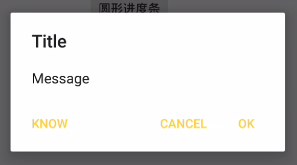
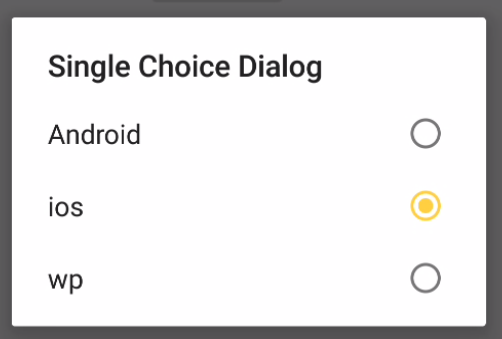

# EasyDialog   
[](https://jitpack.io/#tianzhijiexian/EasyDialog)  

一个DialogFragment的封装库，提供了builder的方式进行调用，因为采用了alertDialog.Builder，所以代码中没有任何自定义，轻量稳定。

### 简介  

原生的Dialog提供了很多Style来让开发者进行自定义，可以满足我们百分之九十的业务需求了。这其实是Android的设计思想，官方“一般”都会把属性值暴露出来，让显示和逻辑分开。因此，本项目并没有重新实现Dialog，而是通过封装了DialogFragment来让大家使用和定制Dialog更加的方便。

这里顺便贴一下dialogFragment的方法调用流程：


### 添加依赖

1.在项目外层的build.gradle中添加JitPack仓库

```  
repositories {
    maven {
	url "https://jitpack.io"
    }
}
```    

2.在用到的项目中添加依赖

> compile 'com.github.tianzhijiexian:EasyDialog:[Latest release](https://github.com/tianzhijiexian/EasyDialog/releases)(<-click it)'  


**举例：**    
> compile 'com.github.tianzhijiexian:EasyDialog:1.1.2'

### 使用方式   

EasyDialog充分利用了原生alertDialog.Builder的api，所以使用方式和alertDialog无异，它提供了如下五种基本的dialog。

**1. 基础对话框**   

  

```JAVA  
EasyDialog.Builder builder = EasyDialog.builder(this); // 建立builder对象

builder.setTitle("Title")
        .setIcon(R.drawable.saber)
        .setMessage(R.string.hello_world)
        
        .setOnCancelListener(dialog -> Log.d(TAG, "onCancel"))
        .setOnDismissListener(dialog -> Log.d(TAG, "onDismiss"))
        
        // 设置下方的三个按钮
        .setPositiveButton("ok", (dialog, which) -> {})
        .setNegativeButton("cancel", (dialog, which) -> dialog.dismiss())
        .setNeutralButton("ignore", null)
        
        .setCancelable(true); // 点击空白处可以关闭

DialogFragment easyDialog = builder.build();

// 用showAllowingStateLoss()弹出
easyDialog.showAllowingStateLoss(getSupportFragmentManager());
```    

**2. 单选对话框**   

  

```JAVA
EasyDialog dialog = EasyDialog.builder(this)
            .setTitle("Single Choice Dialog")
            
            // 这里传入的“1”表示默认选择第二个选项
            .setSingleChoiceItems(new String[]{"Android", "ios", "wp"}, 1,
                    (d, position) -> {d.dismiss();})
            .setPositiveButton("ok", null)
            .build();
            
dialog.show(getSupportFragmentManager(), TAG);
```  

**3. 多选对话框**   

    

```JAVA
EasyDialog.builder(this)
        // 设置数据和默认选中的选项
        .setMultiChoiceItems(
                new String[]{"Android", "ios", "wp"}, new boolean[]{true, false, true},
                (dialog, which, isChecked) -> showToast("onClick pos = " + which))
        .build()
        .show(getSupportFragmentManager());
```  

**4. 简单列表对话框**

  

```xml
<string-array name="country">
    <item>阿尔及利亚</item>
    <item>安哥拉</item>
    <item>贝宁</item>
    <item>缅甸</item>
</string-array>
```

```java
EasyDialog.builder(this)
        // R.array.country为xml中定义的string数组
        .setItems(R.array.country, (dialog, which) -> showToast("click " + which))
        .setPositiveButton("yes", null)
        .setNegativeButton("no", null)
        .build()
        .show(getSupportFragmentManager());
```

### 自定义对话框
   
自定义对话框需要继承自`BaseCustomDialog`。如果需要传入更多的参数，还需要继承自`EasyDialog.Builder`来建立自己的builder。  

```JAVA
public class MyBuilderDialog extends BaseCustomDialog {

    public static final String KEY_AGE = "KEY_AGE", KEY_NAME = "KEY_NAME";

    /**
     * 继承自{@link EasyDialog.Builder}以扩展builder
     */
    public static class Builder extends BaseEasyDialog.Builder<Builder> {

        private Bundle bundle = new Bundle();

        public Builder(@NonNull Context context) {
            super(context);
        }

        public Builder setAge(int age) {
            bundle.putInt(KEY_AGE, age);
            return this;
        }

        public Builder setName(String name) {
            bundle.putString(KEY_NAME, name);
            return this;
        }

        @NonNull
        @Override
        protected EasyDialog createDialog() {
            MyBuilderDialog dialog = new MyBuilderDialog();
            dialog.setArguments(bundle); // 增加自己的bundle
            return dialog;
        }
    }

    @Override
    protected int getLayoutResId() {
        return 0;
    }

    @Override
    protected void bindViews(View root) {

    }

    @Override
    protected void modifyAlertDialogBuilder(AlertDialog.Builder builder) {
        super.modifyAlertDialogBuilder(builder);
        Bundle arguments = getArguments();

        String name = arguments.getString(KEY_NAME);
        int age = arguments.getInt(KEY_AGE);

        String str = "name: " + name + ", age: " + age;

        // 修改builder对象
        builder.setMessage("修改后的message是：\n\n" + str);
    }

    @Override
    protected void setViews() {
        int age = getArguments().getInt(KEY_AGE);
        Toast.makeText(getContext(), "age: " + age, Toast.LENGTH_SHORT).show();
    }

}
```

### 自定义样式  

**在主题中设置默认样式（如果你想用原生的样式，可以跳过这个步骤）**
  
```XML  
<resources>

    <style name="AppTheme" parent="Theme.AppCompat.Light.DarkActionBar">

        <item name="alertDialogTheme">@style/Theme.Dialog.Alert</item>

    </style>

</resources>
```     

```XML
<?xml version="1.0" encoding="utf-8"?>
<resources>

    <style name="Theme.Dialog" parent="Theme.AppCompat.Light.Dialog">
        <item name="windowActionBar">false</item>
        <!-- 有无标题栏 -->
        <item name="windowNoTitle">true</item>

        <!--对话框的边框，一般不进行设置-->
        <item name="android:windowFrame">@null</item>

        <!--是否浮现在activity之上-->
        <item name="android:windowIsFloating">true</item>

        <!-- 是否透明 -->
        <item name="android:windowIsTranslucent">true</item>

        <!--除去title-->
        <item name="android:windowNoTitle">true</item>

        <!-- 对话框是否有遮盖 -->
        <item name="android:windowContentOverlay">@null</item>

        <!-- 对话框出现时背景是否变暗 -->
        <item name="android:backgroundDimEnabled">true</item>

        <!-- 背景颜色，因为windowBackground中的背景已经写死了，所以这里的设置无效 -->
        <item name="android:colorBackground">#ffffff</item>

        <!-- 着色缓存（一般不用）-->
        <item name="android:colorBackgroundCacheHint">@null</item>

        <!-- 标题的字体样式 -->
        <item name="android:windowTitleStyle">@style/RtlOverlay.DialogWindowTitle.AppCompat</item>
        <item name="android:windowTitleBackgroundStyle">@style/Base.DialogWindowTitleBackground.AppCompat</item>

        <!--对话框背景(重要)，默认是@drawable/abc_dialog_material_background-->
        <item name="android:windowBackground">@drawable/dialog_bg_main</item>

        <!-- 动画 -->
        <item name="android:windowAnimationStyle">@style/AlertDialogAnimation</item>

        <!-- 输入法弹出时自适应 -->
        <item name="android:windowSoftInputMode">stateUnspecified|adjustPan</item>

        <item name="windowActionModeOverlay">true</item>

        <!-- 列表部分的内边距，作用于单选、多选列表 -->
        <item name="listPreferredItemPaddingLeft">20dip</item>
        <item name="listPreferredItemPaddingRight">24dip</item>

        <item name="android:listDivider">@null</item>

        <!-- 单选、多选对话框列表区域文字的颜色 默认是@color/abc_primary_text_material_light -->
        <item name="textColorAlertDialogListItem">#00ff00</item>

        <!-- 单选、多选对话框的分割线 -->
        <!-- dialog中listView的divider 默认：@null-->
        <item name="listDividerAlertDialog">@drawable/divider</item>

        <!-- 单选对话框的按钮图标 (默认不为null)-->
        <item name="android:listChoiceIndicatorSingle">@android:drawable/btn_radio</item>

        <!-- 对话框整体的内边距，但不作用于列表部分 默认：@dimen/abc_dialog_padding_material-->
        <item name="dialogPreferredPadding">20dp</item>

        <item name="alertDialogCenterButtons">true</item>

        <!-- 对话框内各个布局的布局文件，默认是@style/Base.AlertDialog.AppCompat -->
        <item name="alertDialogStyle">@style/AlertDialogStyle</item>
    </style>

    <style name="AlertDialogAnimation">
        <item name="android:windowEnterAnimation">@anim/dialog_enter</item>
        <item name="android:windowExitAnimation">@anim/dialog_out</item>
    </style>
    
    <!-- 这里自定义布局 -->
    <style name="AlertDialogStyle" parent="Base.AlertDialog.AppCompat">

        <!-- AlertController.class - line:168 -->

        <!-- dialog的主体布局文件，里面包含了title，message等控件 -->
        <item name="android:layout">@layout/dialog_main_frame</item>
        <!-- dialog中的列表布局文件，其实就是listView -->
        <item name="listLayout">@layout/dialog_list_layout</item>
        <!-- dialog中列表的item的布局 -->
        <item name="listItemLayout">@layout/dialog_list_item</item>
        <!-- 多选的item的布局 -->
        <item name="multiChoiceItemLayout">@layout/dialog_multi_choice_item</item>
        <!-- 单选的item的布局 -->
        <item name="singleChoiceItemLayout">@layout/dialog_single_choice_item</item>
    </style>

    <!-- parent="@style/Theme.AppCompat.Light.Dialog.Alert" -->
    <style name="Theme.Dialog.Alert">
        <item name="windowMinWidthMajor">@dimen/abc_dialog_min_width_major</item>
        <item name="windowMinWidthMinor">@dimen/abc_dialog_min_width_minor</item>
    </style>

    <style name="Theme.Dialog.Alert.Kale">
        <item name="android:windowBackground">@drawable/dialog_bg_custom</item>
    </style>

</resources>
```

### 开发者


Jack Tony: <developer-kale@foxmail.com>  

### License

    Copyright 2016-2019 Jack Tony

    Licensed under the Apache License, Version 2.0 (the "License");
    you may not use this file except in compliance with the License.
    You may obtain a copy of the License at

       http://www.apache.org/licenses/LICENSE-2.0

    Unless required by applicable law or agreed to in writing, software
    distributed under the License is distributed on an "AS IS" BASIS,
    WITHOUT WARRANTIES OR CONDITIONS OF ANY KIND, either express or implied.
    See the License for the specific language governing permissions and
    limitations under the License.
